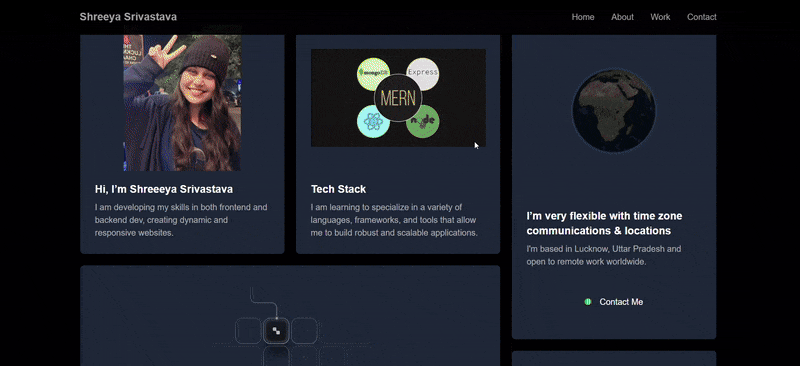

  

<h1 align="center">Undergraduate from MNNIT Allahabad persuing Btech in Computer Science And Engineering </h1>
<h3 align="center">🔹 Code. Optimize. Innovate. | Bridging Logic with Technology 🚀 Turning Ideas into Code | Exploring DSA, CP, ML & Web Dev </h3>

<h3> My portfolio 👉 <a href="https://portfolio-nine-ivory-94.vercel.app/" target="_blank">https://portfolio-nine-ivory-94.vercel.app/</a> 👈 </h3>

  

  

  

- I'm currently learning **Machine Learning and Next.js**
  -Ask me about **React.js,Node.js,C,C++,Python,MongoDb,HTML,CSS,Javascript**
- How to reach me **shreeyasrivastava1124@gmail.com**
- I love competitive programming!

 

---

## 🎯 Competitive Programming Stats

### 🏆 CodeForces

### 💻 LeetCode

### 🍳 CodeChef

---

## 🎨 Anime Vibes

&nbsp;***My Coding Journey with Anime Spirit***

  
  
  

---

<h3 align="left">Connect with me:</h3>

---

<h3 align="left">Languages and Tools:</h3>

                

---

## 📊 GitHub Stats

&nbsp;

---

## 🎭 Coding Activity

  

---

# 🚀 My Projects

  
  
  

## 🤖 Machine Learning And AI Projects

1. **Movie Recommender System**  
   - 🔗 GitHub: https://github.com/shreesriv12/movie-recommender-system
   - 📄 Description: This Movie Recommender System suggests movies based on user preferences using text analysis. It analyzes movie details such as genres, keywords, cast, and crew to determine similarities between films. By leveraging NLP techniques and machine learning, it provides accurate recommendations efficiently.
   
2. **Crop Prediction Model**  
   - 🔗 GitHub: https://github.com/shreesriv12/crop-prediction-model
   - 📄 Description: The Crop Recommendation System is a machine learning-based web application that predicts the most suitable crop for cultivation based on historical data and environmental parameters. It also provides insights into required fertilizers, seeds, market prices, and estimated yield.

3. **Hand Tracking Model**  
   - 🔗 GitHub: https://github.com/shreesriv12/Hand-Tracking-module
   - 📄 Description: This project implements a real-time hand tracking system using OpenCV and MediaPipe. It detects hands in a video feed, extracts hand landmarks, and displays tracking information, including FPS

4. **Youtube-ChatBot**  
   - 🔗 GitHub: https://github.com/shreesriv12/Youtube-ChatBot-using-Langchain
   - 📄 Description: A Chrome Extension + AI Backend that allows users to ask questions about any YouTube video. It fetches the video's transcript, chunks it, embeds it with SentenceTransformers, stores it in FAISS, and uses Gemini AI to answer questions contextually.
  
   - 
## 🌐 Web Development Projects

1. **Assignify(Group Project)--DevJam**  
   - 🔗 GitHub: https://github.com/shreesriv12/DevJam
   - 📄 Description: Assignify is a powerful and intuitive platform designed for students to efficiently manage their assignments, deadlines, and communication. With seamless integration of task tracking, file uploads, and messaging, Assignify simplifies academic workflows and boosts productivity.
   
2. **Mediconnect(Solo Project)**  
   - 🔗 GitHub: https://github.com/shreesriv12/MediConnect
   - 📄 Description: MediConnect is an all-in-one healthcare platform designed to seamlessly connect doctors and clients for hassle-free appointment scheduling, real-time consultations, and easy access to medical resources. Whether you need to book a doctor, chat for advice, or search for medicines, MediConnect provides a smooth and secure experience.

2. **CryptoCred(Group Project)--Hack 36**  
   - 🔗 GitHub: https://github.com/shreesriv12/CryptoCred
   - 📄 Description:A blockchain-based academic certificate storage and verification platform.  
---

## 🌟 Featured Repositories

  
  

---

## 🎌 Random Anime Quote

  

---

  
  
  **Thanks for visiting my profile! Have a great day!** 🌟
  
  
  <i>Happy Coding with Anime Spirit!</i>
  

